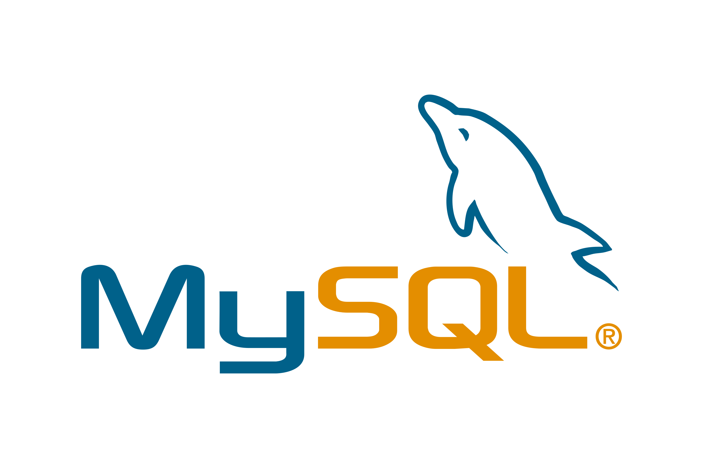

## About Project

Corona-time is a simple and interactive web application where you can register  and see covid-19 statistic all over the world.

On the home page You can see the total statistics of new cases, recoveries and deaths and on next page you can check statistics by country. You can also use the search function to get for particular country statistics or filter countries alphabetically, by number, by new cases or by the number of deaths

The application is bilingual and mobile friendly.You can get content in English and Georgian.


### Prerequisites
​
*  *PHP@8.1 and up*
*  *MYSQL@8 and up*
*  *npm@6 and up*
*  *composer@2 and up*

#
### Tech Stack
​
*  [Laravel@8.x](https://laravel.com/docs/6.x) - back-end framework
​
*  [Spatie Translatable](https://github.com/spatie/laravel-translatable) - package for translation
​
#

### Getting Started
1\. At first, you must clone a repository from github:
```
git clone https://github.com/RedberryInternship/aleksandre-kenchoshvili-corona-time.git
```
​
2\. Next step is to run  *composer install* for install all php dependencies in project.
```
composer install
```
​
3\. after that, you need to  install all the JS dependencies:
```
npm install
```
​
and also:
```
npm run dev
```
in order to build your JS/SaaS resources.
​
4\. Now we need to set our env file. Go to the root of your project and execute this command.
```
cp .env.example .env
```
And now you should provide **.env** file all the necessary environment variables:
​
#

**MYSQL:**
>DB_CONNECTION=mysql
​
>DB_HOST=127.0.0.1
​
>DB_PORT=3306
​
>DB_DATABASE=*****
​
>DB_USERNAME=*****
​
>DB_PASSWORD=*****
​
​
​
after setting up **.env** file, execute:
```
php artisan config:cache
```
in order to cache environment variables.
​
4\. Now execute in the root of you project following:
```
  php artisan key:generate
```
Which generates auth key.


#
### Migration
if you've completed getting started section, then migrating database if fairly simple process, just execute:
```
php artisan migrate
```
​
#
​
​
#
### Development
​
You can run Laravel's built-in development server by executing:
​
```
  php artisan serve
```
​
when working on JS you may run:
​
```
  npm run dev
```
it builds your js files into executable scripts.

#
### Deployment with CI \ CD

​
Continues Development / Continues Integration & Deployment steps:
* To create country table in database and test functionality of the application you should create a table via Command Line with a special command source : php artisan make:country
​
​
* After creating a table you have  practically whole information. You can register  and get full access to the website


Thats all
​
#
### DrawSQL
 
​


